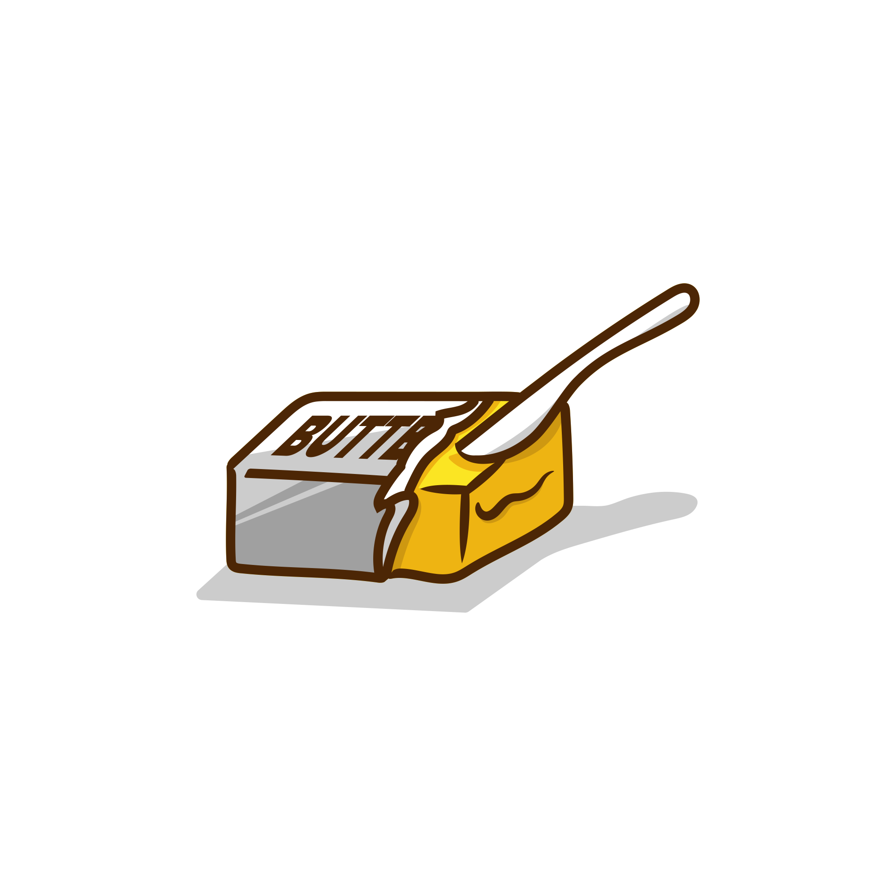
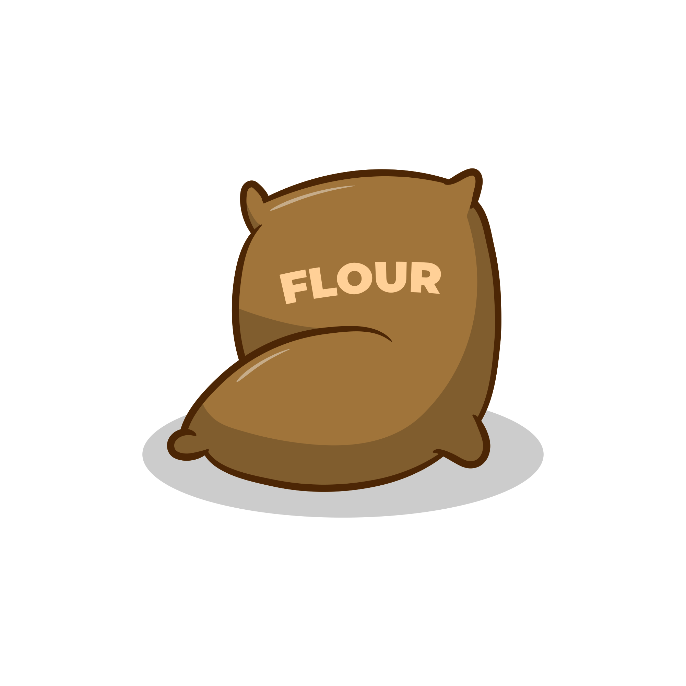

# 🌅 NFT Profile & Badges

.png>)

PancakePoll aims to offer its users the profile customization option, therefore, users can use their bought NFTs to set up their avatars and profile banners. Only NFTs acquired through the PancakePoll NFT Marketplace will be allowed in the first phase

## The PancakePoll NFT Badges

The NFT Badges are a new unique and complex mechanism that the team has come up with. Each NFT Badge is earned by being active on the PancakePoll platform, by voting, or by buying votes. The latter option offers a slight increase in the badge drop chances.

At the present, the team has come up with three NFT Badge tiers.

### First-Tier

First-tier being the passive NFT Badges. These NFT Badges grant the user special abilities and bonuses.

* Double Vote (normal users can vote the same token once every 24h)
* Permanent fee or store discounts
* Unlock VIP features (that usually requires a subscription to be paid)
* Able to access and read the PancakePoll API
* and many more..

These NFT Badges are not burned when used and will drop for a fixed limited number then never be created again. Our team has settled for the moment on a drop rate of "1 in 1,000,000" site-wide votes, making them a very rare occurrence, so the price of the Tier I NFT Badges is expected to be high.

### Second-Tier

Second-tier are the consumable NFT Badges. These NFT Badges grant the user special one-time rewards and bonuses,

* Discounts on advertising packages.
* Promoting your favorite token for 24h.
* Adding 100 votes to your favorite token instantly.
* and many more..

These NFT Badges are burned when used and will drop an unlimited number of times, users being able to hold up to 10 duplicates. Our team has settled for the moment on a drop rate of "1 in 100,000" site-wide votes, making them a rare occurrence but far more common than any Tier II NFT Badges.

### Event-Tier

Event-tier are the consumable NFT Badges that drop only during limited-time events, such as Halloween, Christmas, Easter, or during platform celebrations and milestones. These NFT Badges grant the user special one-time rewards and bonuses.

**All the NFT Badges earned on the PancakePoll platform can also be sold on the PancakePoll NFT Marketplace.**



     

Get 6 Props Collections to get Random Duck Collections


