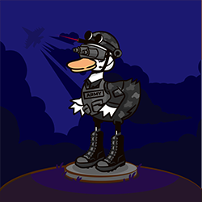

# 🤖 NFT Earn

## Duck Egg

Duck Egg is a new kind of crypto-collectible, which you can hatch and get new Duck NFT by doing so.

Duck Egg Info

Category : Egg

## Jack the Rookie

Jack the Rookie Info

Category : Duck

Rarity : Rookie (Common)

Exp : 1

Level : 1

## Mark the Captain

Mark the Captain Info

Category : Duck

Rarity : Captain (Uncommon)

Exp : 1

Level : 2

## Hugh the Master

Hugh the Master Info

Category : Duck

Rarity : Master (Rare)

Exp : 1

Level : 3

## Onyx the Shadow

Onyx the Shadow Info

Category : Duck

Rarity :Shadow (Epic)

Exp : 1

Level : 4

## Seth the Mind

Seth the Mind Info

Category : Duck

Rarity : Mind (Legendary)

Exp : 1

Level : 5

## Hades the Supreme

Hades the Supreme Info

Category : Duck

Rarity : Supreme (Mythical)

Exp : 1

Level : 6

