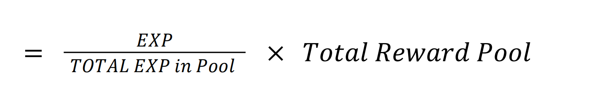

# ♾ NFT Staking Pool

Your Duck **NFTs** can be staked in the **NFT Staking Pool.**

Reward Calculation **:**

Example: Total reward pool = 2500

| Holder | Total DB Hold | Total Reward Get |
| ------ | ------------- | ---------------- |
| A      | 150,000 EXP   | 1500 PPOLL       |
| B      | 60,000 EXP    | 600 PPOLL        |
| C      | 40,000 EXP    | 400 PPOLL        |

### NFT Staking Pool - Daily Distribution

The daily distribution of the QUACK tokens in the NFT staking pool depends on the total number of DB staked in the pool. The more Experience Points staked in the pool, the more PPOLL/DUCK tokens will be distributed. The table below depicts the daily distribution in DUCK tokens in relation to the number of DB staked in the pool.&#x20;

|     Total DB Staked    | Daily Distribution in DUCK |
| :--------------------: | :------------------------: |
|       0 - 250 000      |           10 000           |
|    250 001 - 500 000   |           20 000           |
|   500 001 - 1 000 000  |           30 000           |
|  1 000 001 - 1 500 000 |           50 000           |
| ​1 500 001 - 2 000 000 |           60 000           |
|  2 000 001 - 3 000 000 |           80 000           |
|  3 000 001 - 4 000 000 |           100 000          |
| 4 000 001 - 10 000 000 |           140 000          |


_**DuckLabs reserves the right in its sole discretion to change or amend the Daily distribution amount depending on the price of the DUCK/PPOLL tokens and the market situation.**_


## Join the OFFICIAL social media of DuckLabs⬇

💬  **Main** **TG Chat**: [https://t.me/pancakepollbsc](https://t.me/pancakepollbsc)

📣  **News Channel**: [https://t.me/pancakepollann](https://t.me/pancakepollann)

🕊️  **Twitter**: [https://twitter.com/PancakePoll](https://twitter.com/PancakePoll)

✅  **Official website**: [https://pancakepoll.com/](https://pancakepoll.com/)
